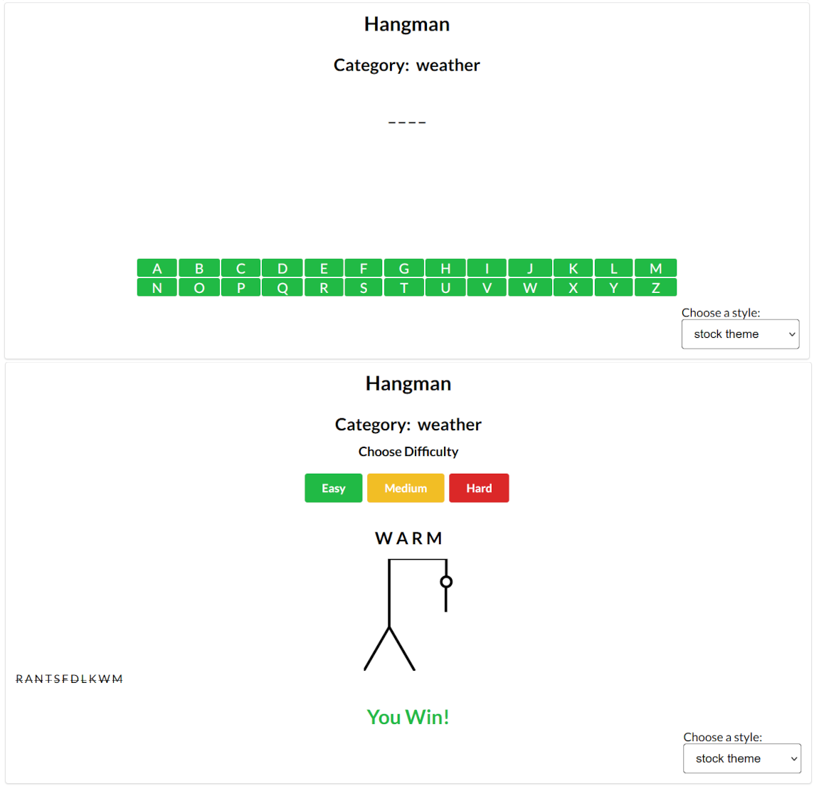
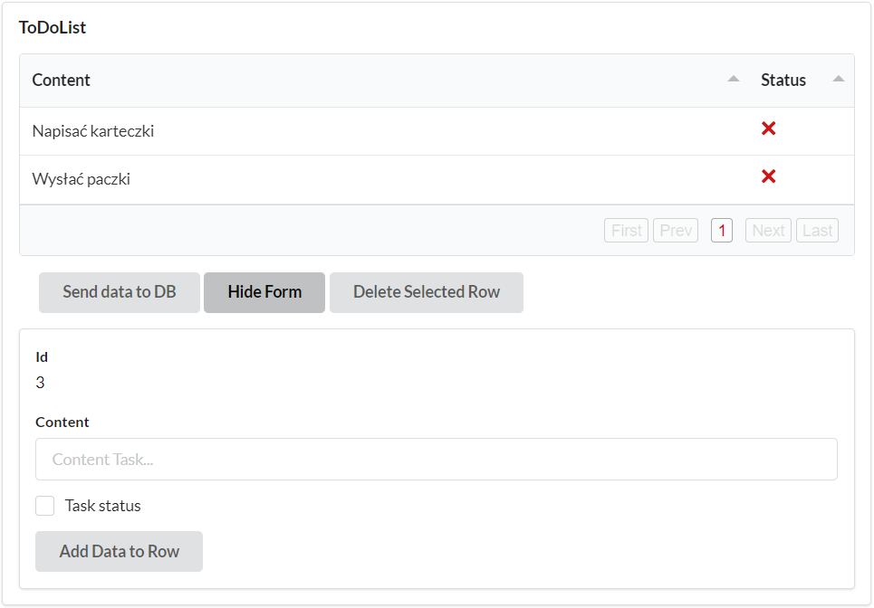
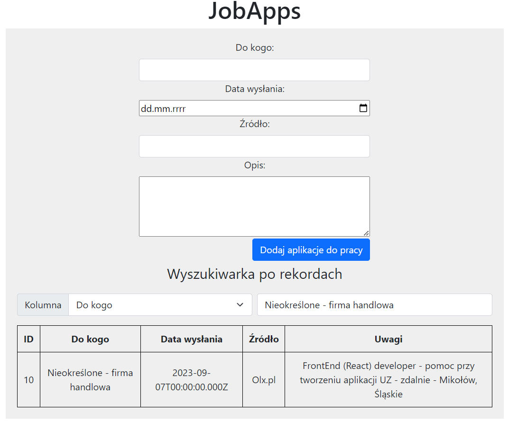
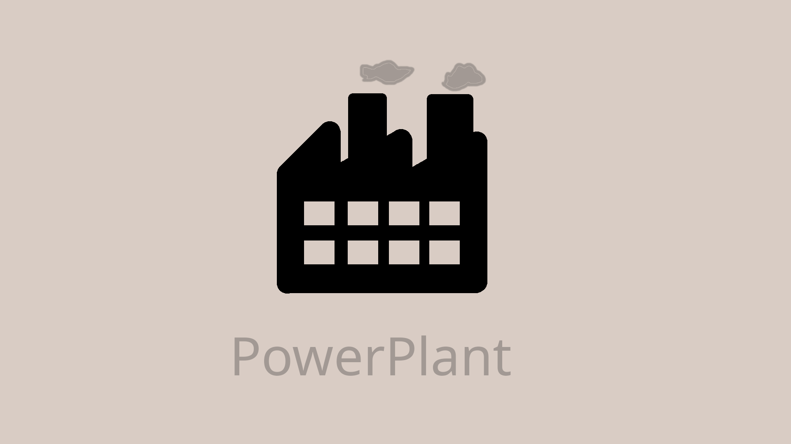
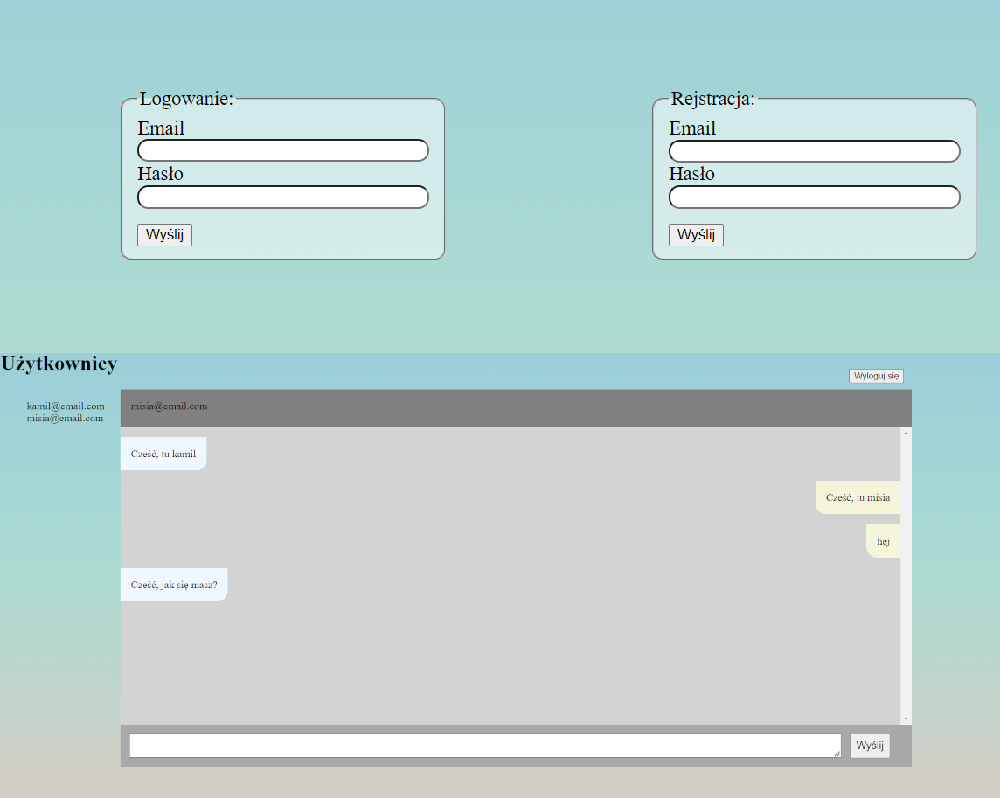
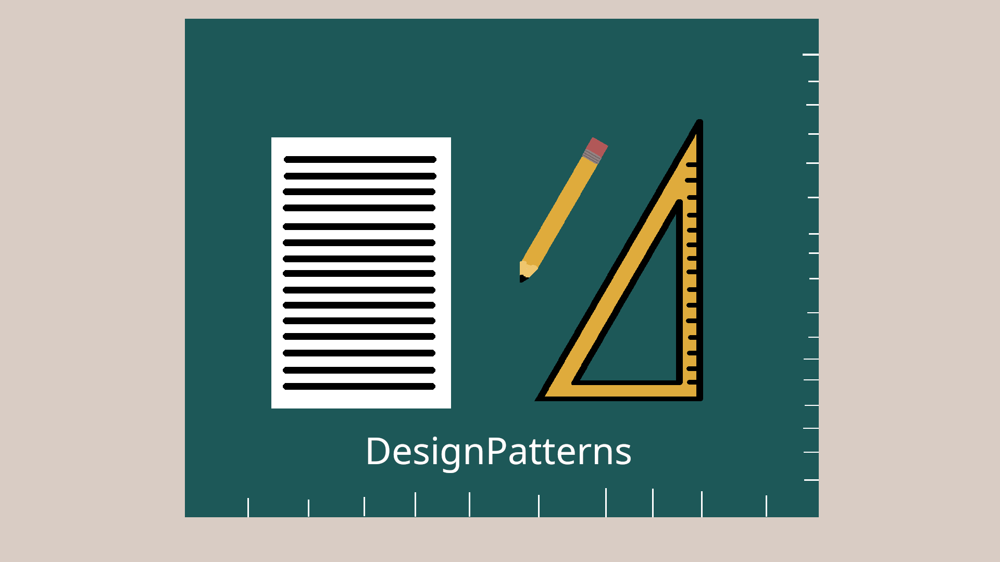

    

        

            

            <a href="/" class="btn btn-outline-dark"><i class="fs-4 bi-house"></i>Home</a>
            <a href="/contact" class="btn btn-outline-dark"><i class="fs-4 bi-telephone-outbound"></i>Contact</a>
            <a href="/about" class="btn btn-outline-dark"><i class="fs-4 bi-person-raised-hand"></i>About me</a>
            <a href="/portfolio" class="btn btn-outline-dark active" aria-current="page"><i class="fs-4 bi-github"></i>Portfolio</a>
            <a href="/rates" class="btn btn-outline-dark"><i class="fs-4 bi-coin"></i>Rates</a>
          

        

    

    

      

        

            

                
Moje projekty

            

        

        

            

                

                
                

                    <h5 class="card-title">Hangman</h5>
                    
Randomly select a word from a file, have the user guess characters in the word.For each character they guess that is not in the word, have it draw another partof a man hanging in a noose. If the picture is completed before they guess allthe characters, they lose.

                    <a href="https://github.com/kamilszwaradzki/Hangman" target="_blank" class="btn btn-dark">View code</a>
                

                

            

            

                

                
                

                    <h5 class="card-title">Todolist</h5>
                    
The program allows you to manage the list of tasks. It's a simple CRUD.

                    <a href="https://github.com/kamilszwaradzki/ToDoList" target="_blank" class="btn btn-dark">View code</a>
                

                

            

            

                

                
                

                    <h5 class="card-title">JobApps</h5>
                    
An application to help manage sent job applications. It features filtering and sorting by columns and allows you to change statuses at any time.

                    <a href="https://github.com/kamilszwaradzki/awesome-compose/tree/master/react-express-mongodb" target="_blank" class="btn btn-dark">View code</a>
                

                

            

            

                

                
                

                    <h5 class="card-title">PowerPlant</h5>
                    
The application simulates the operation of 20 power generators that send data at short intervals on the power generated, the data is stored in a MongoDB database and once a day a report is generated from all the generators with the average power generated by each generator during the hour.

                    <a href="https://github.com/kamilszwaradzki/PowerPlant" target="_blank" class="btn btn-dark">View code</a>
                

                

            

            

                

                
                

                    <h5 class="card-title">ChatBetweenUsers</h5>
                    
The app allows you to chatting with other authenticated user.

                    <a href="https://github.com/kamilszwaradzki/ChatBetweenUsers" target="_blank" class="btn btn-dark">View code</a>
                

                

            

            

                

                
                

                    <h5 class="card-title">Design Patterns in PHP</h5>
                    
My design patterns implementations in PHP from book "Head First! Design Patterns" 1st edition

                    <a href="https://github.com/kamilszwaradzki/WzorceProjektowe" target="_blank" class="btn btn-dark">View code</a>
                

                

            

        

        

            

                <a href="https://github.com/kamilszwaradzki?tab=repositories" id='btn-show-all' class="btn btn-outline-secondary"
                target="_blank">Pokaż wszystkie</a>
            

        

      

    

  
